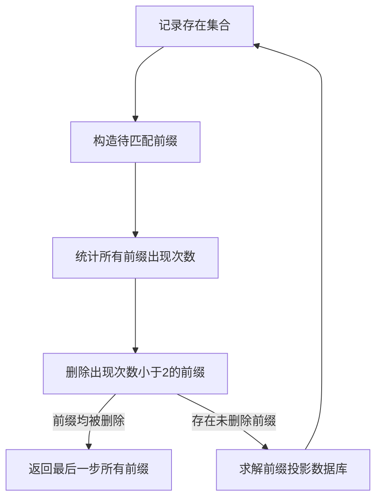

## 算法设计原理

PrefixSpan 算法的全称是 Prefix-Projected Pattern Growth，直译为前缀投影的模式挖掘，也是一种关联规则挖掘算法。与 Apriori 算法，Fp-Growth 算法等类似，它们都是挖掘某个出现次数频繁的东西。Apriori 和 FpGrowth 算法挖掘频繁项集，而 PrefixSpan 算法挖掘的是频繁序列。

在介绍算法设计原理前需要对项集、序列、前缀、前缀投影的概念做一个定义，一个例子可见下面的实例分析一节。

1. 项集是若干个项的集合
2. 序列则是项集的有序排列
3. 前缀是算法中待搜索匹配的序列
4. 前缀投影的得到方式是：对每条序列从头开始扫描，如果不是前缀就删除这个项集，如果这个项集是前缀，也删除这个元素，此时求解剩余序列是前缀投影

算法从长度为 1 的前缀开始挖掘序列模式，搜索对应的前缀投影数据库，得到长度为 1 的前缀对应的频繁序列。随后递归的挖掘长度为 2 的前缀所对应的频繁序列，依次类推。直到不再存在可继续增加后缀的搜索序列时算法结束。

## 算法流程

1. 搜索整个数据库，记录存在的数据集合。
2. 对于数据集合内的每个元素，构造待匹配的前缀。
3. 对于每个前缀，计算其在表格内的出现次数。
4. 对于所有出现次数小于 2 的，所有前缀的最大出现次数一定大于等于该前缀，于是删除这条待匹配前缀。
5. 如果所有前缀都被删除，则这些前缀为被挖掘的频繁模式，算法结束。否则算法继续进行。
6. 对于每个前缀与数据库的每条完整序列求解前缀投影数据库。
7. 对于前缀投影数据库，回到第 1 步。

概括流程图如下。

## 实例分析

假设有如下数据库，有四条记录，每个记录是一个序列，每个序列中有若干有序项集。

| ID  | 序列                        |
| --- | --------------------------- |
| 1   | {a} {a,b,c} {a,c} {d} {c,f} |
| 2   | {a,d} {c} {b,c} {a,e}       |
| 3   | {e,f} {a,b} {d,f} {c} {b}   |
| 4   | {e} {g} {a,f} {c} {b} {c}   |

执行算法流程前四步，得到前缀并统计出现次数，删除为出现次数小于 2 的 g。

| a   | b   | c   | d   | e   | f   | ~~g~~ |
| --- | --- | --- | --- | --- | --- | ----- |
| 4   | 4   | 4   | 3   | 3   | 3   | ~~1~~ |

求解各个前缀的前缀投影数据库，用 x 代表空序列。

- a
  - {a} {a,b,c} {a,c} {d} {c,f}
  - {~~a~~,d} {c} {b,c} {a,e}
  - {~~a~~,b} {d,f} {c} {b}
  - {~~a~~,f} {c} {b} {c}
- b
  - {~~a~~,c} {a,c} {d} {c,f}
  - {~~a~~,c} {a,e}
  - {d,f} {c} {b}
  - {c}
- c
  - {a,c} {d} {c,f}
  - {b,c} {a,e}
  - {b}
  - {b,c}
- d
  - {c,f}
  - {c} {b,c} {a,e}
  - {~~a~~,f} {c} {b}
  - x
- e
  - x
  - x
  - {~~a~~,f} {a,b} {d,f} {c} {b}
  - {a,f} {c} {b} {c}
- f
  - x
  - x
  - {a,b} {d,f} {c} {b}
  - {c} {b} {c}

随后对于每个前缀投影求解数据库，返回递归继续求解即可，最终得到被挖掘的频繁序列。

## 算法优缺点与适用场景

- 优点
  - PrefixSpan 算法不用直接产生完整候选序列，且投影数据库不断，内存消耗比较稳定，作频繁序列模式挖掘的时候效果很好，比起其他的序列挖掘算法有较大优势。
  - 算法较为简单，逻辑不复杂，在生产环境中运行稳定，容易维护。
- 缺点
  - PrefixSpan 算法面对序列数据集较大，递归的前缀的复杂度指数级别上升，构造投影数据库开销变大，算法运行速度与内存占用变差。
- 适用场景
  - 电子商务交易序列的模式识别，例如用户的购买行为序列。
  - 社交媒体数据分析，例如推文或评论的时间序列模式。
  - 生物医学信号处理，如心电图或脑电图信号序列的特征提取。

## 进一步改进建议

- 注意到构造前缀与投影数据库的过程中不同前缀的求解不同分支的求解不存在依赖关系，可尝试并行优化或是移植到 GPU 上。
- 对于算法的访存模式进一步优化，减少因数据存储格式稀疏导致的运行效率下降。
- 对于输入数据做数据清洗与离散化处理，减少运行时数据库的内存占用，加快处理速度。
